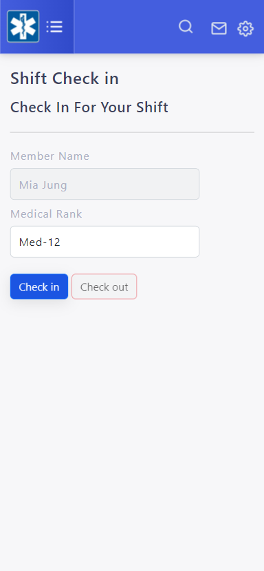
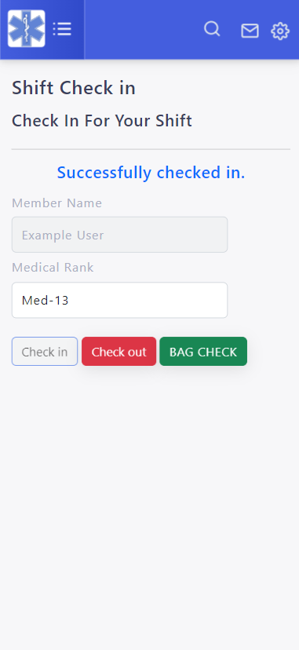
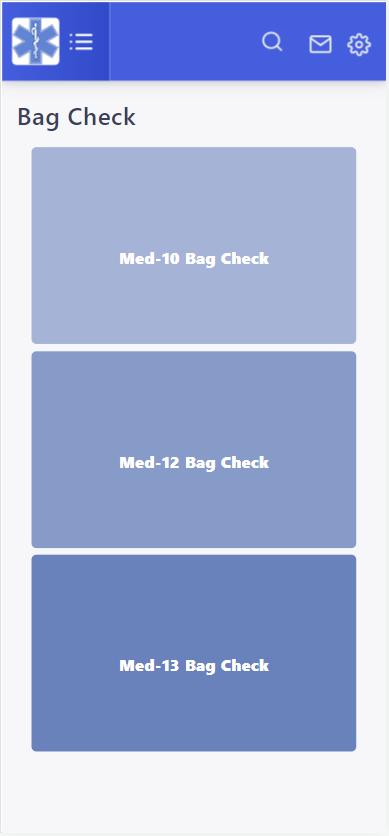
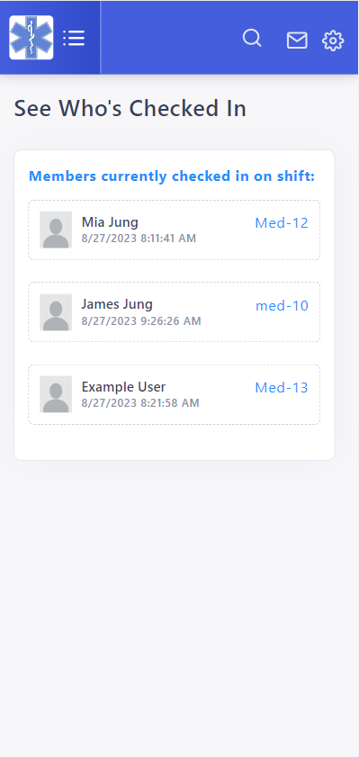
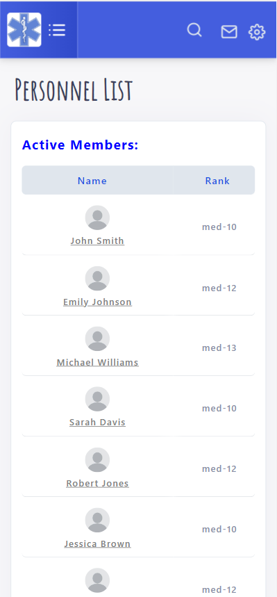
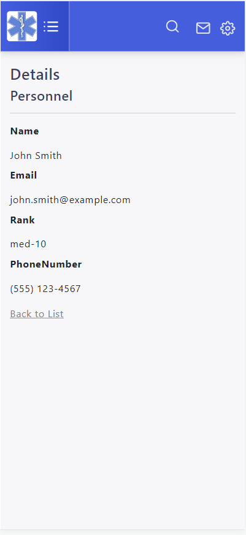
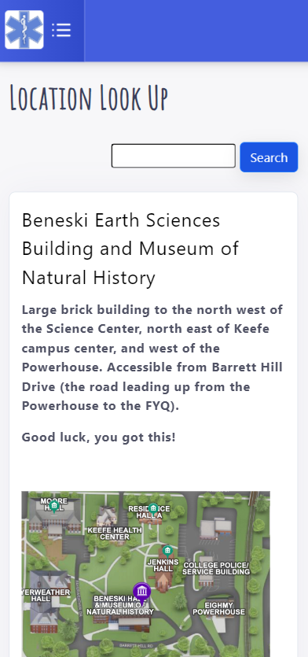

# EMS On Scene: Team Support App for Campus Emergency Medical Services
*This is an open-source EMS App for gathering your EMS squad resources and communications into one cute & easily navigable app, better-streamlined your emergency service team organization.* 

*The objective is to share this app with other EMS teams out there who may be interested in taking this app and adapting it for their own teams. 
We are trying to make this app  more accessible for beginner developers, and are trying to create helpful tips and how-to guidelines.*

### What our Appp Looks Like:
                        

### Guide to Utilizing this App for Your EMS Team:

If you're looking to streamline your EMS team's operations, this app provides a powerful solution. Follow these steps to set it up for your team's specific requirements:

1.  **Clone the Project Repository:** Begin by cloning the project repository to your local environment. This will give you access to the app's source code and resources.
    
2.  **Deploy Your Custom Mobile Web:** Once you have the repository, deploy your customized mobile web version onto a hosting server website. Detailed instructions on how to do this can be found in the [“How to Deploy a Web Application to a Hosting Server” guide](https://github.com/J-S-Lab/ems-on-scene/blob/main/web/ems-onscene/README.md). This step ensures your app is accessible to your team members.
    
3.  **Register and Grant "Admin" Privileges:** Access the deployed mobile web and complete the registration process. To ensure you have full control over the app's features, grant yourself "admin" usage rights during the registration.
    
4.  **Configure Organization Settings:** Navigate to the Admin Menu and find the "Organization Settings" section. Here, input essential details such as your EMS team's name, logo, and other pertinent information. Customizing these settings personalizes the app for your team.
    
5.  **Tailor Information to Your Team:** Explore the Admin Menu and delve into the various pages available. These pages are designed to accommodate your team's unique structure and needs. Fill in the information as required to accurately reflect your team's hierarchy, roles, and any other relevant details.
    

By following these steps, you'll transform this app into a powerful tool that aligns with your EMS team's requirements. Seamlessly adapt the app's features, structure, and information to enhance your team's efficiency and communication during critical operations.
  
### To-Do List For Those Looking to Contribute to This Open Source:
 - [x] ["How to deploy web application to hosting server”](https://github.com/J-S-Lab/ems-on-scene/blob/main/web/ems-onscene/README.md) 
 - [ ] [“How to setup Development Environment Variable for ios”](https://github.com/J-S-Lab/ems-on-scene/blob/main/cordova/emsoncall/ios.md)
 - [ ] “Implementation User Guide for EMS Organizations Looking to Adopt this app.”

### Implemented How-To Guides (please edit and add to these!):
* [“How to run your initial cordova app on the browser”](https://github.com/J-S-Lab/ems-on-scene/tree/main/cordova/emsoncall/browser.md)
* [“How to setup Development Environment Variable for Android”](https://github.com/J-S-Lab/ems-on-scene/blob/main/cordova/emsoncall/android.md)
* [“How to Turn on Developer Mode on Your Android Phone”](https://github.com/J-S-Lab/ems-on-scene/blob/main/cordova/emsoncall/android-developer-mode.md) 
* [“How to deploy web application to hosting server”](https://github.com/J-S-Lab/ems-on-scene/blob/main/web/ems-onscene/README.md)

### Some App Updates & Additional Features the Developers are Cooking Up:
 - [ ] Bag Checker Feature Update
 - [ ] Check Shift Schedule Feature
 - [ ] Push Notification for in-app Messages
 - [ ] Real-Time Location Sharing for People Checked In on Shift
 - [ ] Digitalizing the Run Report

### Contributing
Contributions are welcome! Whether you've found a bug, want to add a new feature, or just have a suggestion, feel free to open an issue or pull request.
