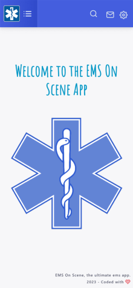

# EMS On Scene: Team Support App for Campus Emergency Medical Services
*This is an open-source EMS App for gathering your EMS squad resources and communications into one cute & easily navigable app, better-streamlined your emergency service team organization.* 

*The objective is to share this app with other EMS teams out there who may be interested in taking this app and adapting it for their own teams. 
We are trying to make this app  more accessible for beginner developers, and are trying to create helpful tips and how-to guidelines.*

### To-Do List For Those Looking to Contribute to This Open Source:
 - [x] ["How to deploy web application to hosting server”](https://github.com/J-S-Lab/ems-on-scene/blob/main/web/ems-onscene/README.md) 
 - [ ] [“How to setup Development Environment Variable for ios”](https://github.com/J-S-Lab/ems-on-scene/blob/main/cordova/emsoncall/ios.md)
 - [ ] “Implementation User Guide for EMS Organizations Looking to Adopt this app.”

#### Implemented How-To Guides (please edit and add to these!):
* [“How to run your initial cordova app on the browser”](https://github.com/J-S-Lab/ems-on-scene/tree/main/cordova/emsoncall/browser.md)
* [“How to setup Development Environment Variable for Android”](https://github.com/J-S-Lab/ems-on-scene/blob/main/cordova/emsoncall/android.md)
* [“How to Turn on Developer Mode on Your Android Phone”](https://github.com/J-S-Lab/ems-on-scene/blob/main/cordova/emsoncall/android-developer-mode.md) 
* [“How to deploy web application to hosting server”](https://github.com/J-S-Lab/ems-on-scene/blob/main/web/ems-onscene/README.md)

### Some App Updates & Additional Features the Developers are Cooking Up:
 - [ ] Bag Checker Feature Update
 - [ ] Check Shift Schedule Feature
 - [ ] Push Notification for in-app Messages
 - [ ] Real-Time Location Sharing for People Checked In on Shift
 - [ ] Digitalizing the Run Report

### Screenshots

### Contributing
Contributions are welcome! Whether you've found a bug, want to add a new feature, or just have a suggestion, feel free to open an issue or pull request.
